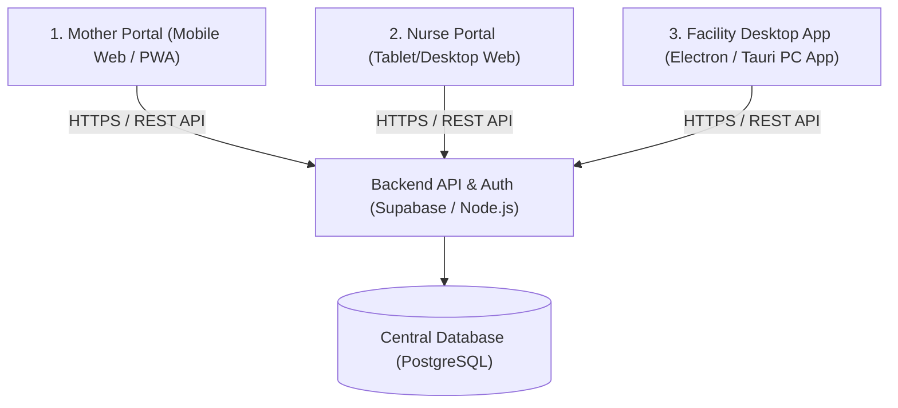
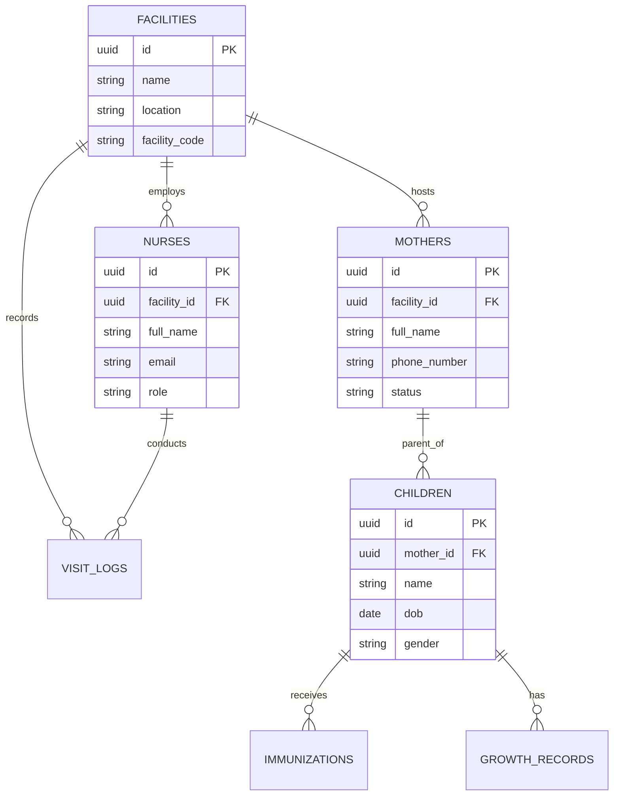

# System Split & Centralized Database Architecture Guide

This document outlines the architectural plan for transitioning your unified Vite React app into three separate applications that share a centralized, multi-facility database.

---

## 1. Architectural Overview

Instead of one app serving three routes with a local database, we will separate the system into three distinct frontend applications communicating with a single Backend API and Database.



---

## 2. Recommended Technology Stack

| Component | Technology | Rationale |
| :--- | :--- | :--- |
| **Central Backend & DB** | **Supabase** (PostgreSQL) | Fast to set up, built-in Authentication, instant REST APIs, real-time sync, and Row-Level Security (RLS). |
| **Mother Portal** | **React / Vite (Mobile Web or PWA)** | Easily accessed on any smartphone browser. Converting it to a Progressive Web App (PWA) lets mothers install it on their home screens and work offline. |
| **Nurse Portal** | **React / Vite (Web App)** | Separate URL/deployment optimized for clinic tablets or laptops. |
| **Facility Portal** | **Tauri or Electron (React Desktop App)** | Tauri/Electron wraps your React codebase into a native executable (`.exe`) for Windows, giving it a native PC app feel. |

---

## 3. Database Design for Multi-Facility Support

To support different facilities, we must design the database schemas with a **multi-tenant** model. Every child, mother, nurse, and record must belong to a specific facility.

### Proposed Database Schema



### Key Multi-Tenant Strategy
* **`facility_id` Column:** Every primary entity (like `MOTHERS`, `NURSES`, and `VISIT_LOGS`) must contain a `facility_id` column.
* **Row-Level Security (RLS):** Ensure that a nurse logged in under `Facility A` can only view and update records belonging to `Facility A`. If you use Supabase, this is handled automatically in the database using SQL policies.

---

## 4. How to Split the Frontends

### Option A: Monorepo (Recommended)
Instead of having three completely separate repositories, use a monorepo structure (like **Turborepo** or **npm workspaces**). 
* **Why?** All 3 apps will share the same components, UI elements (shadcn config), utility functions, and API client wrappers.
* **Structure:**
  ```text
  /my-project
    ├── /apps
    │    ├── /mother-portal   (React/Vite app)
    │    ├── /nurse-portal    (React/Vite app)
    │    └── /facility-pc     (React/Vite + Tauri/Electron app)
    ├── /packages
    │    ├── /ui              (Shared UI components)
    │    ├── /api-client      (Shared database client integrations)
    │    └── /tsconfig        (Shared configurations)
  ```

### Option B: Polyrepo (Multi-repo)
Three completely separate Git repositories. Good if different developers are working on different apps, but duplicates UI components and CSS config.

---

## 5. Step-by-Step Implementation Roadmap

### Phase 1: Set Up the Shared Database & API
1. Create a project on **Supabase** (it gives you a free Postgres database and API endpoints).
2. Migrate your local entities (`Mother`, `Child`, `ANCVisit`, `GrowthRecord`, `Immunization`) into database tables.
3. Configure authentication tables so Mothers, Nurses, and Facility Administrators have distinct accounts and roles.

### Phase 2: Split the Current App into 3 Projects
1. Make a copy of your codebase for the three apps (or organize them into folders).
2. **Mother Portal:** Remove `/nurse` and `/facility` page files, code, and routes from this project. Deploy to `mother.yourdomain.com`.
3. **Nurse Portal:** Remove mother UI and facility UI page files. Deploy to `nurse.yourdomain.com`.
4. **Facility Portal:** Remove other routes, and set up **Tauri** or **Electron** in this project to generate a desktop `.exe` installer.

### Phase 3: Swap LocalStorage with the Real API
In each app's database client (replacing [totoafyaClient.js](file:///c:/Users/rickm/Downloads/totoreplit/totoreplit/src/api/totoafyaClient.js)):
* Replace the `localStorage` operations with Supabase client SDK calls (`supabase.from('Mother').select('*')`).
* All three apps will now write to and read from the central database in real time.
